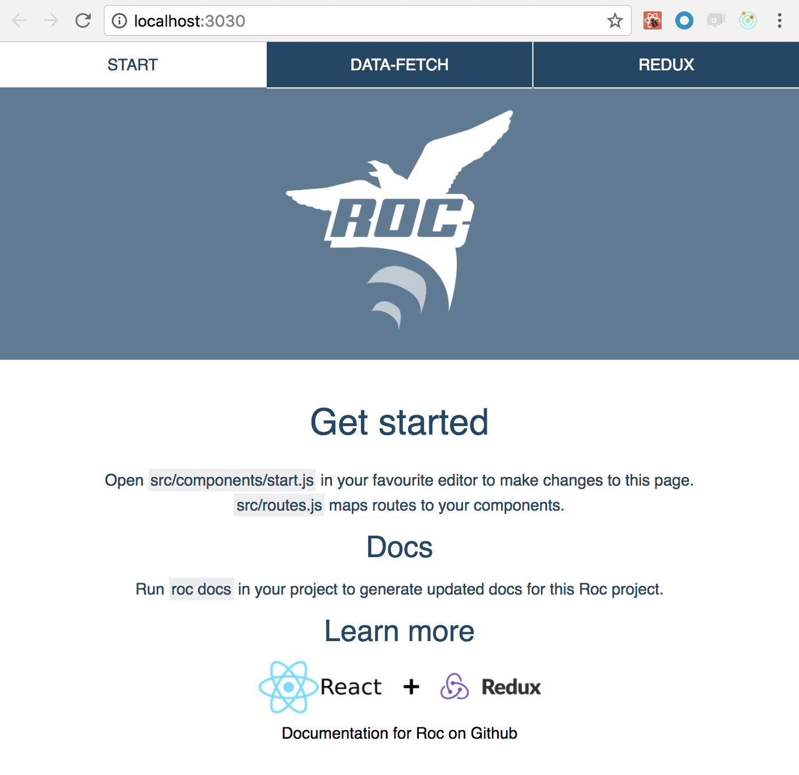

# User-guide

`roc-package-web-app-react` provides a complete _framework_ for creating and running ambitious Node.js and React web applications. It is developed by [Schibsted](http://www.schibsted.com/en/About-Schibsted/Schibsted-Products-and-Technology/) and used in production for many products.

It is a perfect match for writing fully-featured web applications that use `React` components and `Redux` to handle your flow of data. It does not compromise on features or flexibility. Plugins are available for all important features like styling pipelines and automated testing.

The guide covers all the basic elements that you need in order to be productive with `web-app-react`. We assume you already know ES2015+, Node.js and some web development using React and Redux.

## Table of Contents

- Installing Roc
- Bootstrapping your app
- File structure of your app
- Roc command basics
- Tooling configuration
- Runtime configuration
- Writing components
- Styling components
- Adding extra resources
- Routing
- Fetching data
- Data flow
- Adding server side behaviour
- Testing your app
- Modifying webpack and babel configurations
- Including extra scripts in bundles
- Polyfills and language features
- Troubleshooting

## Installing Roc

You need `Node.js` 4.x+ and `npm` 3.x+ to use Roc. You can install Roc globally on your system using `npm`.

`$ npm i -g roc@next`

## Creating your app:

Bootstrapping a new project in the location of your choice is fully automated. Replace `my-app` in the command below with your preferred name.

`$ roc new my-app web-app-react wip`

The automated bootstrap process will ask you some questions. We recommend that you answer `Y` to data fetching and Redux examples, unless you have a clear plan on how this works already. The examples are easy to delete from your app later if you do not need them.

## File structure of your app

```
├── public
│   └── favicon.png
├── src
│   ├── components
│   │   ├── ...
│   │   ├── index.js
│   │   ├── reset.scss
│   │   └── style.scss
│   ├── redux
│   │   ├── clicker.js
│   │   ├── reducers.js
│   │   └── repo.js
│   └── routes.js
├── package.json
└── roc.config.js
```

`src/components` - components of the application  
`src/routes.js` - react router mapping  
`public/` - files served directly from web server  
`roc.config.js` - application configuration  
`package.json` - npm package data  

Some of these files can be deleted as they are only for illustration and demo purposes.
The structure set up for you is only a suggestion and can be adjusted using roc.config.js. Jump to [tooling configuration](toolingconfiguration) for details.

## Command basics

Roc has a CLI (Command Line Interface) that is used for all common operations when working with your project.

The Roc CLI yields different functionality depending on where it is invoked. When used within a `web-app-react` project like in this guide, it provides a comprehensive collection of information:

```
$ roc

Found a local version of Roc, will use that over the global one.

Usage: roc <command>

Commands:
 lock                                    Locks down Roc dependencies to fixed alpha versions.
 start [artifact]                        Starts the current project.

Project creation:
 create init [template] [version]        Init a new project.
 create new <name> [template] [version]  Create a new project.

Project development:
 development build [targets]             Build the current project.
 development clean                       Cleans the current project.
 development dev [targets]               Starts the current project in development mode.
 development test [targets]              Runs tests on the current project.

Meta commands:
 meta docs                               Generates documentation for the current project.
 meta list-settings                      Prints all the available settings that can be changed.

General options:
 -b, --better-feedback                   Enables source-map-support and loud-rejection.
 -c, --config                            Path to configuration file.
 -d, --directory                         Path to working directory.
 -h, --help                              Output usage information.
 -V, --verbose                           Enable verbose mode.
 -v, --version                           Output version number.
```

We used the `project creation` group when bootstrapping our project in the previous section. What deserves our attention now are the additional commands grouped under `project development` as well as `start`:

```
Project development:
 development build [targets]             Build the current project.
 development clean                       Cleans the current project.
 development dev [targets]               Starts the current project in development mode.
 development test [targets]              Runs tests on the current project.
```

These commands are important for your development workflow and they can be abbreviated as `roc build`, `roc clean`, `roc dev` and `roc test`. For information about how to use the commands and their available settings add `-h` when running them.

Your bootstrapped project has also created aliases in your `package.json` for these commands, so `npm run build`, `npm start` etc. also work as expected.

To start the development server and launch the app in your browser, run  
`$ roc dev` which will open a new tab like in the screenshot:



Here you see your React app running in development mode. You can open the files in your favourite editor and they will be live-reloaded in the browser as you make modifications to them. Development mode is powerful in this Roc extension and provides a great set of tools ready to be used.

By default you can open Redux DevTools by pressing `ctrl+h` on your keyboard. A running BrowserSync instance can be found on port `3031`.

Development mode is reserved for local development only. You should never use it in production.

Use `roc build` to build bundles optimized for production. Start them with `roc start`.

You can view helpful information about any of the commands at any time by adding a `-h` flag to the command. For example `roc dev -h`

```
$ roc dev -h
Found a local version of Roc, will use that over the global one.

Usage: roc development dev [targets]

Starts the current project in development mode.

Arguments:
... Lots of settings ...
```

The output from `-h` brings us onto `tooling configuration`.

## Tooling configuration

When a Roc command is run it will read configuration from three potential sources and respect them in a particular and prioritized order:

1. Parameters passed to the command-line
2. Environment variable (ROC_CONFIG_SETTINGS)
3. roc.config.js

The available configuration to a Roc command is exactly what `-h` outputs. Some examples from `roc dev -h` are:

```
--build-name        The name of the generated application bundle.
--build-path        The basepath for the application.
--build-reducers    The reducers to use if no entry file is given, will use default entry files.
```

For clarity we will demonstrate how we can change the `--build-name` setting using the three different configuration methods.

### Modify the build name directly on the CLI

`roc dev --build-name="different-name"`

Settings defined directly on the CLI like this will always have **highest priority**

### Modify the build name with an environment variable

```
$ export ROC_CONFIG_SETTINGS='{ "build": { "name": "different-name" } }';
$ roc dev
```

ROC_CONFIG_SETTINGS are deep-merged on top of settings from roc.config.js

### Modify the build name permanently from the project using roc.config.js

```js
{
  //... other things
  build: {
    name: "different-name"
  }
}
```

How you choose to set your configration is up to you, but we **highly recommend**:
- Use CLI parameters for temporary configuration and experiments
- `roc.config.js` for configuration that must follow your project permanently and have it checked into source control with the rest of the project.  

Only use the environmental `ROC_CONFIG_SETTINGS` in situations where you for some reason have no choice, for example certain CI servers or sandboxed environments. The Roc CLI will actually warn you when something is appended using `ROC_CONFIG_SETTINGS` to help avoid unexpected implicit behaviour as a result of these being set. It is easy to forget previously defined environment variables.


The tooling configuration that we just introduced takes care of build-time information as well as some framework-specific settings controlled by `web-app-react`. We recommend you spend a little time to get familiar with them.

You should _not_ mix your own application-specific `Runtime configuration` with these. This is handled separately by design.

## Runtime configuration

Most applications need to bring their own set of configurations that must also vary depending on the environment. Examples of this can be
- Host of backend servers to use
- Feature flags
- Language settings

Hardcoding values like this that can vary in different environments is not a great idea.

To solve this in a good manner, `web-app-react` includes and exposes [node-config](https://github.com/lorenwest/node-config) to your project. It takes care of all your configuration needs.

### Defining runtime configuration with node-config
Create a new directory `config/` in your project root. Here you may define `js` or `json` files named after the environment (`NODE_ENV`) of choice. For example:

```
config/
    development.json
    production.json
    custom-environment-variables.json
```

`production.json` will be loaded when NODE_ENV is set to `production` and can contain your configuration:

```json
{
  "host": "github.com",
  "DANGEROUSLY_EXPOSE_TO_CLIENT": {
    "backendHost": "www.getroc.org"
  }
}
```

The concept of `DANGEROUSLY_EXPOSE_TO_CLIENT` shown in the example config is unique to `web-app-react` and is actually controlled by the setting `--runtime-configWhitelistProperty`. Configuration under this key will be serialized and served to clients as well.

It is very useful to handle configuration values that must be accessible in both server and client environments. For example components that are rendered on both server and client _both_ need to know where to fetch their data from. The values under `DANGEROUSLY_EXPOSE_TO_CLIENT` solve this elegantly. It allows us to have a clear split between universal configuration and secrets that should be server-side only.

`node-config` also supports using individual environmental variables to define runtime configuration. These can be mapped in the file `custom-environment-variables.json`. See the [docs](https://github.com/lorenwest/node-config/wiki/Environment-Variables#custom-environment-variables) for details.

### Reading runtime configuration for your app

So now that we know how to define configuration we need to know how to read and use them in our web application. There are two different use-cases: reading server-only values (including secrets) and reading those available to both server and client (universal).

#### Server only

In your server modules you can read runtime configuration like this:

```
import config from 'config';

console.log(config.host); // github.com
```

`config` will contain the entire configuration, including secrets.

#### Shared (universal)

In your universal modules you can read runtime configuration like this:

```
import { appConfig as config } from 'roc-package-web-app-react/app/shared/universal-config';

console.log(config.backendHost); // www.getroc.org
```

`config` will contain only the configuration that was grouped under `DANGEROUSLY_EXPOSE_TO_CLIENT`.

## Writing components

Roc exposes `React` and `prop-types` to your project, and does **not** introduce any abstraction or extra APIs that you need to be aware of. You can define your React components like any other vanilla React project.

Examples:

```js
import React, { Component } from 'react';

export default class Example extends Component {
  render() {
    return (
      <h1>A component</h1>
    );
  }
}
```

```js
import React from 'react';

export default () => (
  <h1>A stateless component</h1>
);
```

## Styling components

Roc does not enforce a particular way of styling components on you. We do however give a fully working styling pipeline as a part of the default template used in this guide; provided by `roc-plugin-style-sass`. This plugin can be found in your `package.json` and removed if you wish to replace it with something else later.

`roc-plugin-style-sass` is a very powerful and flexible way of handling styles in your app. It uses [sass](http://sass-lang.com/) for pre-processing and also includes [css-module](https://github.com/css-modules/css-modules) support out of the box.

- You can import `.css` and `.scss` files directly in your components
- The style imports will be an object with classnames that can be referenced in your component
- All webpack loaders and configuration is set up for you, just write your `sass` and use it
- Your app already uses this pipeline to provide some styles for demo purposes

Minimal example:

`style.scss`

```scss
.stylish {
  color: pink;
};
```

`component.js`

```js
import React from 'react';

import style from './style.scss';

export default () => (
  <h1 className={ style.stylish }>A stateless component</h1>
);
```

Because `roc-plugin-style-sass` uses css-modules by default, you do not need to worry about any other component defining `.stylish` and colliding.  

`style.stylish` as used in the example will be a random and unique hash that matches the corresponding class in the css-bundle that is built for you and automatically available in your application.

If you for some reason wish to disable css-modules or adjust other configuration to customize the style build pipeline:

```
 --build-style-modules                  If CSS Modules should be enabled.
 --build-style-name                     The naming pattern to use for the built style files.
 --build-style-sourceMap                If CSS source maps should be enabled.
 --build-style-autoprefixer-browsers    What browsers that should be supported.
```

These follow `roc-plugin-style-sass` and will no longer be available if you remove the plugin from your project.

## Adding extra resources

If you need to include extra resources like global styles or scripts into the start of your application bundle this can be done using the `--build-resources` configuration.

```
--build-resources    An array of files to include into the build process.
```

Note that the default value for this configuration is `["roc-package-web-app-react/styles/base.css"]` which contains some [css-resets](https://github.com/rocjs/roc-package-web-app-react/blob/master/extensions/roc-package-web-app-react/styles/base.css). If you wish to add more resources by redefining this array be sure to include this default explicitly, otherwise you will lose the resets. For example `["roc-package-web-app-react/styles/base.css", "styles/somethingelse.css"]`

## Routing

### Routes definition

React router 3.x is included for you and is ready to be used. Roc expects to find the routes in the location configured by `--build-routes`.

```
--build-routes    The routes to use if no entry file is given, will use default entry files internally.
```

In your project this is set to `src/routes.js` and contains the following:

```
// ...
import App from './components';
import Start from './components/start';
import Fetching from './components/fetching';
import Redux from './components/redux';

export default () => (
  <Route component={App}>
    <IndexRoute component={Start} />
    <Route component={Fetching} path="/fetching/" />
    <Route component={Redux} path="/redux/" />
  </Route>
);
```

The routes file exports a function that returns a declarative configuration of which route path should render what component. Quick explanation:  
- `App` is the wrapping component for all routes
- `Start` is rendered when the IndexRoute (`/`) is requested
- `Fetching` is rendered when `/fetching/` is requested
- `Redux` is rendered when `/redux/` is requested

You have complete ownership of this and can expose any component you like on any path.

Read more about React router 3.x in the offical docs  [here](https://github.com/ReactTraining/react-router/blob/v3/docs/guides/RouteConfiguration.md).

By default `web-app-react` wraps the React router configuration with its own [application wrapper](https://github.com/rocjs/roc-package-web-app-react/blob/a6d3bd17ce59995da31b0984f33b148f9be47239/extensions/roc-package-web-app-react/app/shared/application.js). This is configurable by
```
--build-useDefaultRoutes    If Roc should use an internal wrapper around the routes, please look at the documentation for more details.
```

If you wish to opt out of this and configure the entire React router hierarchy by yourself you can set this to `false`. Note that this will affect the document structure of your app, and for example `<base/>` will be missing.

### Route transitioning

If you want to perform a transition to another react route gracefully on the client when the user clicks a link, the link can be rendered like this:

```js
impot { React } from 'react';
import { Link } from 'react-router';

export default () => (
  <Link to="/fetching/">A link!</Link>
);
```

`components/header/index.js` demonstrates this well as it drives the application menu by rendering links.

## Fetching data

Most applications need to fetch data from external sources. Let's face it, applications without data are not very useful.  
`web-app-react` aims to make data-fetching a great experience.

In various tech stacks it is very common to do data-fetching in the `componentDidMount` component lifecycle of React. However this is problematic because it has some large limitations: it is only executed on the client and not when server rendering components.

Only fetching data on the client using mechanisms like `componentDidMount` results in delays and visible flash of content because we must wait for the data to arrive before it can be rendered. For creating a good user experience what we **actually** want the ability to do is:

- Trigger new data fetches upon route transitions (for example, the user navigates from `/` to `/data`)
- Do data fetching on the server so that we do not always have to wait on the client for shared/common data
- Do data fetching on the client only, for personalized content and similar things that are unique to the user
- Choose to do data fetching before or after a route transition has taken place on the client

To achieve all of this, `web-app-react` provides [react-router-redial](https://github.com/dlmr/react-router-redial).  
It exposes an API that allows us to enhance our components rendered by `react-router` with dedicated data-fetching capabilities.

Using it is simple:
- In your component; import `provideHooks` from `react-router-redial`
- Set up a `provideHooks` configuration object, by default we have `fetch` and `defer` function hooks available to us
  - `fetch` will trigger on both servers and clients
  - `defer` will trigger on client only, and it will not block any transitions
- Perform the fetching using your libraries of choice in the appropriate hook and use `setProps` to update your component once you have the data

Simplified example:

```javascript
import React, { Component } from 'react';
import { provideHooks } from 'redial';

@provideHooks({
  // by default, fetch is run on both server and client side
  fetch: ({ setProps }) => {
    return fetchRocRepos() // function that returns promise to return json data
    .then((json) => {
      setProps({
        repo: json,
      });
  },
  // by default, defer only runs on the client side after transition
  defer: ({ setProps }) => fetchRocStargazers()
    .then((json) => {
      setProps({
        stars: json.stargazers_count,
      });
    }),
})
// Your component that uses the props 'repo' and 'stars'...
```

You can see a complete example of this in your application (`src/components/fetching/index.js`) if you answered `Y` to include data-fetching.

The hooks themselves can also be configured further using Roc. The defaults are good, but being able to add more and finely tune this provides us with a lot of power:

```
--runtime-fetch-server                    What redial hooks that should run on the server and in what order.
--runtime-fetch-client-afterTransition    What redial hooks that should run on the client that should not block route transitions and in what order.
--runtime-fetch-client-beforeTransition   What redial hooks that should run on the client that blocks route transitions and in what order.
--runtime-fetch-client-parallel           If defer hooks should be started at the same time as the blocking ones.
```

## Data flow
[Redux](http://redux.js.org/docs/introduction/) is a very popular library that implements unidirectional flow of data along with a great way of `connect`ing this store of data to any of your React components.

### Connecting components to the Redux store

As our applications grow in size and complexity; handling `state` using just React `Component` and `setState` can start to become tedious.


`web-app-react` integrates `Redux` as a first-class citizen and it is available for you to use. Roc does not modify the API of Redux; it only aims to be readily configured.

Example of a redux-connected component in a project:

```javascript
import { connect } from 'react-redux';

@connect(state => ({
  myprop: state.somevalue,
}))
export default class MyComponent extends Component {
  static propTypes = {
    myprop: React.PropTypes.number,
  }

  render() {
    const { myprop } = this.props;

    return (
      <h1>Redux demo: { myprop }</h1>
    );
  }
}
```

The value from Redux `state.somevalue` is now connected to `MyComponent` accessible as the `prop` `myprop`.

### Redux actions

#### Defining actions
Roc does not dictate how you structure your actions or action creators. You just need to be able to import them in required contexts.

Example `actions.js`:

```javascript
export function myAction() {
  return {
    type: 'SOMETHING'
  };
}
```

#### Dispatching actions
Roc does not dictate how you dispatch actions. Just import your action and `dispatch` it. `dispatch` is available in the object passed as argument to the data fetching hooks and as a `prop` on Redux `connect`ed React components.

```javascript
import { connect } from 'react-redux';
import { myAction } from './actions';

@connect()
class ConnectedComponent extends Component {
  render() {
    return (
      <button onClick={ () => { this.props.dispatch(myAction()); } } />
    );
  }
}
```

If you answered `Y` to include a Redux demo in your app you can view some example actions in the bottom of `src/redux/repo.js`

### Redux reducers
Roc bootstraps Redux for us and expects to find your reducers exported in the file configured by

```
--build-reducers    The reducers to use if no entry file is given, will use default entry files internally.
```

This file must have the reducer functions as named exports. The export name will be used as the key in the Redux store.

If you answered `Y` to include a Redux demo in your app you can view this file in your project which exports reducers: `src/redux/reducers.js`.

### Fetching data with Redux

The hooks that can be used for data-fetching also have access to Redux `dispatch`. Additionally [redux-thunk](https://github.com/gaearon/redux-thunk) is included for you, meaning that you _can_ dispatch thunk actions in your app.

If you answered `Y` to include a Redux demo in your app you can view example usage of redux-thunk in the context of data-fetching in `src/redux/index.js` within your project.

In addition there exists Redux middlewares that you can opt to install to address the needs of data-fetching using Redux actions and reducers in a generic manner; for example [redux-api-middleware](https://github.com/agraboso/redux-api-middleware)

### Redux middlewares
If you wish to add Redux middlewares like `redux-api-middleware` above you can add them to the file configured by

```
--build-redux-middlewares    The middlewares to use if no entry file is given, will use default entry files internally.
```

In your project this will be the default `src/redux/middlewares.js`. This file should have a function as the default export. This function can return an array of Redux middlewares of your choice.

### Redux sagas

[redux-saga](https://github.com/redux-saga/redux-saga) is a popular library to help deal with side-effects in a good way. This is also available in `web-app-react` and can be used by providing the file configured by
```
--build-redux-sagas    The Redux Saga to use as the root saga.
```

It expects the root saga to be the default export. You can look at the [example](https://github.com/rocjs/roc-package-web-app-react/blob/master/examples/complex/src/sagas.js) to see Sagas in action.

## Adding server side behaviour

[Koa.js 1.x](http://koajs.com/) is included as the HTTP server and you can hook into the power of Koa middlewares to help build your application. As a user of `web-app-react` you have access several Koa settings that can be adjusted:

```
$ roc dev -h | grep koa
```

The most interesting setting is
```
--build-koaMiddlewares    The koa middlewares to add to the server instance, will be added after the default middlewares.
```

which can be used to add your own custom middlewares to Koa.

### Adding your own Koa middleware

Koa middlewares allow you to react to any request made to your HTTP server. Example operations are adding new server-side routes or adding HTTP-headers to all requsts. The example below adds a Koa middleware that logs `Roc rocks` on every request.

`src/server/middlewares.js`

```
const oneMiddleware = function* (next) {
  console.log('Roc rocks');
  yield next;
};

export default (settings, { server }) => [ oneMiddleware ];
```

Note that the function provides the Roc runtime `settings` and Koa `server` instance as arguments which can be taken into consideration before returning the final list of middlewares.

### Accessing the Redux store from a Koa middleware
For your convenience the Redux store is made available to you in your own Koa middlewares through `this.state.reduxStore`. This can be used to perform Redux operations on the server. Useful if you need to pass some data from the server side to be used on the client.

## Testing your app

## Polyfills and language features

## Troubleshooting
