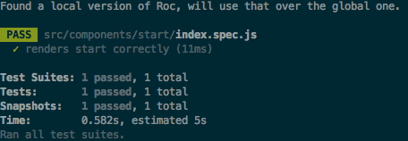

# User-guide

`roc-package-web-app-react` provides a complete _framework_ for creating and running ambitious Node.js and React web applications. It is developed by [Schibsted](http://www.schibsted.com/en/About-Schibsted/Schibsted-Products-and-Technology/) and used in production across many products.

It is a perfect match for writing fully-featured server-rendered web applications that use [React](https://facebook.github.io/react/) components and [Redux](http://redux.js.org/) to handle your flow of data. It does not compromise on features or flexibility. [Plugins](https://github.com/rocjs/roc/blob/master/docs/Extensions.md) are available for all important features like styling pipelines and automated testing.

The guide covers all the basic elements that you need in order to be productive with `web-app-react`. We assume you already know ES2015+, Node.js and have some web development experience using React and Redux.

## The underlying technology:

`web-app-react` provides the following stack fully configured with sane defaults

- HTTP server: [Koa.js 1.x](http://koajs.com/)
- UI library: [React](https://facebook.github.io/react/)
- Data-flow: [Redux](http://redux.js.org/)
- Routing: [React-router 3.x](https://github.com/ReactTraining/react-router/tree/v3)
- Transpiling: [Babel](http://babeljs.io/)
- Bundling: [Webpack 1.x](http://webpack.github.io/docs/)

## Table of Contents

- [Installing Roc](#installing-roc)
- [Creating your app](#creating-your-app)
- [File structure of your app](#file-structure-of-your-app)
- [Roc command basics](#roc-command-basics)
- [Tooling configuration](#tooling-configuration)
- [Runtime configuration](#runtime-configuration)
- [Writing React components](#writing-react-components)
- [Styling React components](#styling-react-components)
- [Special variables](#special-variables)
- [Adding extra resources](#adding-extra-resources)
- [Extending the root HTML document](#extending-the-root-html-document)
- [Routing](#routing)
- [Fetching data](#fetching-data)
- [Data flow](#data-flow)
- [Adding server side behaviour](#adding-server-side-behaviour)
- [Testing your app](#testing-your-app)
- [Modifying webpack and babel configurations](#modifying-webpack-and-babel-configurations)
- [Polyfills](#polyfills)
- [Language features](#language-features)
- [Start without Roc CLI](#start-without-roc-cli)
- [Custom entry points](#custom-entry-points)
- [Docker](#docker)
- [Troubleshooting](#troubleshooting)

## Installing Roc

You need `Node.js` 4.x+ and `npm` 3.x+ to use Roc. You can install Roc globally on your system using `npm`.

`$ npm i -g roc@next`

## Creating your app:

Bootstrapping a new project in the location of your choice is fully automated. Replace `my-app` in the command below with your preferred name.

`$ roc new my-app web-app-react wip`

The automated bootstrap process will ask you some questions. We recommend that you answer `Y` to data fetching and Redux examples, unless you have a clear plan on how this works already. The examples are easy to delete from your app later if you do not need them.

## File structure of your app

```
├── public
│   └── favicon.png
├── src
│   ├── components
│   │   ├── ...
│   │   ├── index.js
│   │   ├── reset.scss
│   │   └── style.scss
│   ├── redux
│   │   ├── clicker.js
│   │   ├── reducers.js
│   │   └── repo.js
│   └── routes.js
├── package.json
└── roc.config.js
```

`src/components` - UI components of the application  
`src/routes.js` - React router setup  
`public/` - Files served directly from web server  
`roc.config.js` - Application configuration  
`package.json` - npm package data  

Some of these files can be deleted as they are only for illustration and demo purposes.
The structure set up for you should be viewed as a suggestion and can be adjusted at any time using `roc.config.js`. Jump to [tooling configuration](#tooling-configuration) for details.

## Roc command basics

Roc has a CLI (Command Line Interface) that is used for all common operations when working with your project.

The Roc CLI yields different functionality depending on where it is invoked. When used within a `web-app-react` project like in this guide, it provides a comprehensive collection of information:

```
$ roc

Found a local version of Roc, will use that over the global one.

Usage: roc <command>

Commands:
 lock                                    Locks down Roc dependencies to fixed alpha versions.
 start [artifact]                        Starts the current project.

Project creation:
 create init [template] [version]        Init a new project.
 create new <name> [template] [version]  Create a new project.

Project development:
 development build [targets]             Build the current project.
 development clean                       Cleans the current project.
 development dev [targets]               Starts the current project in development mode.
 development test [targets]              Runs tests on the current project.

Meta commands:
 meta docs                               Generates documentation for the current project.
 meta list-settings                      Prints all the available settings that can be changed.

General options:
 -b, --better-feedback                   Enables source-map-support and loud-rejection.
 -c, --config                            Path to configuration file.
 -d, --directory                         Path to working directory.
 -h, --help                              Output usage information.
 -V, --verbose                           Enable verbose mode.
 -v, --version                           Output version number.
```

We used `new` from the `Project creation` group when bootstrapping our project in the previous section. What deserves our attention now are the additional commands grouped under `Project development` as well as the `start` command:

```
Project development:
 development build [targets]             Build the current project.
 development clean                       Cleans the current project.
 development dev [targets]               Starts the current project in development mode.
 development test [targets]              Runs tests on the current project.
```

These commands are important for your daily development workflow and they can be abbreviated as `roc build`, `roc clean`, `roc dev` and `roc test`. For information about how to use the commands and their available settings add the help option `-h` (`--help`) when running them.

Your bootstrapped project has also created command aliases in your `package.json` for these commands, so `npm run build`, `npm start` etc. also work as expected for those already familiar with npm scripts.

To start the development server and launch the app in your browser, run  
`$ roc dev` which will open a new tab like in the screenshot:


Here you see your React app running in development mode. You can open the files in your favourite code editor and they will be live-reloaded in the browser as you make modifications to them. Development mode in your Roc project is powerful and you get a great set of tools that are ready to be used. No extra setup required.

By default you can open Redux DevTools in the browser by pressing `ctrl+h` on your keyboard. A running BrowserSync instance can be found on port `3031`.

Development mode is reserved for local development only. **You should never use it in production.**

Use `roc build` to build bundles optimized for production. Start them with `roc start`.

You can view helpful information about any of the commands at any time by adding a `-h` flag to the command. For example `roc dev -h`

```
$ roc dev -h
Found a local version of Roc, will use that over the global one.

Usage: roc development dev [targets]

Starts the current project in development mode.

Arguments:
... Lots of settings ...
```

The output from `-h` brings us onto `tooling configuration`.

## Tooling configuration

When a Roc command is run it will read configuration from three potential sources and respect them in a particular and prioritized order:

1. Parameters passed to the command-line
2. Environment variable (ROC_CONFIG_SETTINGS)
3. roc.config.js

The available configuration to a Roc command is exactly what `-h` outputs. Some examples from `roc dev -h` are:

```
--build-name        The name of the generated application bundle.
--build-path        The basepath for the application.
--build-reducers    The reducers to use if no entry file is given, will use default entry files.
```

For clarity we will demonstrate how we can change the `--build-name` setting using the three different configuration methods.

### Modify the build name directly on the CLI

`roc dev --build-name="different-name"`

Settings defined directly on the CLI like this will always have **highest priority**

### Modify the build name with an environment variable

```
$ export ROC_CONFIG_SETTINGS='{ "build": { "name": "different-name" } }';
$ roc dev
```

ROC_CONFIG_SETTINGS are deep-merged on top of settings from roc.config.js

### Modify the build name permanently from the project using roc.config.js

```javascript
{
  //... other things
  build: {
    name: "different-name"
  }
}
```

How you choose to set your configration is up to you, but in general we **highly recommend**:
- Use CLI parameters for temporary configuration and experiments
- `roc.config.js` for configuration that must follow your project permanently; and have it checked into source control with the rest of the project.  

Only use the environmental `ROC_CONFIG_SETTINGS` in situations where you for some reason have no other choice. For example certain CI servers or sandboxed environments.  
The Roc CLI will actually warn you when settings are appended using `ROC_CONFIG_SETTINGS` to help avoid unexpected implicit behaviour as a result of these being set. It is easy to forget about previously defined environment variables.


The tooling configuration that we just introduced takes care of build-time information as well as some framework-specific settings controlled by `web-app-react`. We recommend you spend a little time to get familiar with them.

You should _not_ mix your own application-specific `Runtime configuration` with this tooling configuration. They are handled separately by design.

## Runtime configuration

Most applications need to bring their own unique sets of configurations that can also vary depending on the environment. Examples of this can be
- Host of backend API servers to use
- Feature flags for the application
- Language settings

Hardcoding configuration values like this that can vary in different environments is not a great idea.

To solve this in a good manner, `web-app-react` includes and exposes [node-config](https://github.com/lorenwest/node-config) to your project. It takes care of all your configuration needs.

### Defining runtime configuration with node-config
Create a new directory `config/` in your project root. Here you may define [files in a supported format](https://github.com/lorenwest/node-config/wiki/Configuration-Files) named like the corresponding environment (`NODE_ENV`) of choice. For example:

```
config/
    development.json
    production.json
```

`production.json` will be loaded when NODE_ENV is set to `production` and should contain your configuration:

```json
{
  "host": "github.com",
  "DANGEROUSLY_EXPOSE_TO_CLIENT": {
    "backendHost": "www.getroc.org"
  }
}
```

The concept of `DANGEROUSLY_EXPOSE_TO_CLIENT` shown in the example config above is unique to `web-app-react` and is actually controlled by the setting `--runtime-configWhitelistProperty`. Configuration under this particular key will be serialized and served to clients as well.

Components that are rendered on both server and client _both_ need to know where to fetch their data from. The values under `DANGEROUSLY_EXPOSE_TO_CLIENT` solve this elegantly. It allows us to have a clear split between universal configuration and secrets that should be server-side only.

`node-config` also supports using individual environmental variables to define important runtime configuration. These can be mapped in the file `custom-environment-variables.json`. See the official  [docs](https://github.com/lorenwest/node-config/wiki/Environment-Variables#custom-environment-variables) for details.

### Reading runtime configuration for your app

So now that we know how to define configuration we need to know how to read and use them in our web application. There are two different use-cases: reading server-only values (including secrets) and reading those available to both server and client (universal).

#### Server only

In your server modules (for example Koa middlewares) you can read runtime configuration like this:

```javascript
import config from 'config';

console.log(config.host); // github.com
```

`config` will contain the entire configuration, including secrets.

#### Shared (universal)

In your universal modules (for example React components) you can read runtime configuration like this:

```javascript
import { appConfig as config } from 'roc-package-web-app-react/app/shared/universal-config';

console.log(config.backendHost); // www.getroc.org
```

`config` will contain only the configuration that was grouped under `DANGEROUSLY_EXPOSE_TO_CLIENT` in your definition.

## Writing React components

Roc exposes `React` and `prop-types` to your project, and does **not** introduce any abstraction or extra APIs that you need to be aware of. You can define your React components like any other vanilla React project.

Examples:

```javascript
import React, { Component } from 'react';

export default class Example extends Component {
  render() {
    return (
      <h1>A component</h1>
    );
  }
}
```

```javascript
import React from 'react';

export default () => (
  <h1>A stateless component</h1>
);
```

You can consult the [official docs for React](https://facebook.github.io/react/docs/components-and-props.html) on components and props.

## Styling React components

Roc does not enforce a particular way of styling components on you. We do however give a fully working styling pipeline as a part of the default template used in this guide; provided by `roc-plugin-style-sass`. This plugin can be found in your `package.json` and removed if you wish to replace it with something else later.

`roc-plugin-style-sass` is a very powerful and flexible way of handling styles in your app. It uses [sass](http://sass-lang.com/) for pre-processing and also includes [css-module](https://github.com/css-modules/css-modules) support out of the box.

- You can import `.css` and `.scss` files directly in your components
- The style imports will be an object with classnames that can be referenced in your component
- All webpack loaders and configuration is set up for you, just write your `sass` and use it
- Your app already uses this pipeline to provide some styles for demo purposes

Minimal example:

`style.scss`

```scss
.stylish {
  color: pink;
};
```

`component.js`

```javascript
import React from 'react';

import style from './style.scss';

export default () => (
  <h1 className={ style.stylish }>A stateless component</h1>
);
```

Because `roc-plugin-style-sass` uses css-modules by default, you do not need to worry about any other component defining `.stylish` and colliding.  

`style.stylish` as used in the example will be a random and unique string that matches the corresponding class in the css-bundle that is built for you and automatically available in your application.

If you for some reason wish to disable css-modules or adjust other configuration to customize the style build pipeline:

```
 --build-style-modules                  If CSS Modules should be enabled.
 --build-style-name                     The naming pattern to use for the built style files.
 --build-style-sourceMap                If CSS source maps should be enabled.
 --build-style-autoprefixer-browsers    What browsers that should be supported.
```

These follow `roc-plugin-style-sass` and will no longer be available if you remove the plugin from your project.

You can explicitly disable css-modules on an import by adding `?modules=false` to the import path. For example
```javascript
import style from './style.scss?modules=false';
```

Styling components is an area with a lot of differing opinions and available options in the community. Using the plugin as-is will **save you a lot of time** unless you strictly need something else. If you prefer `less` there is a plugin that you can install instead; [roc-plugin-style-less](https://github.com/rocjs/roc-plugin-style-less).

## Special variables

Webpack is used for creating your application bundles and we make use of the [DefinePlugin](http://webpack.github.io/docs/list-of-plugins.html#defineplugin)

The following useful constants are available to you in your project code:
- \_\_WEB\_\_
  - Boolean. `true` if client bundle.
- \_\_NODE\_\_
  - Boolean. `true` if server bundle

These are extra useful because they are evaluated at `compile time`. They can be used to make sure code is only included in a specific bundle. For example:

```javascript
if (__WEB__) {
  console.log('I will only exist in the client bundle.');
}

if (__NODE__) {
  console.log('I will only exist in the server bundle.');
}
```

Will in your final **server** bundle be:

```javascript
console.log('I will only exist in the server bundle.');
```

## Adding extra resources

If you need to include extra resources like global styles or scripts into the start of your application bundle this can be done using the `--build-resources` configuration.

```
--build-resources    An array of files to include into the build process.
```

Note that the default value for this configuration is `["roc-package-web-app-react/styles/base.css"]` which contains some [css-resets](https://github.com/rocjs/roc-package-web-app-react/blob/master/extensions/roc-package-web-app-react/styles/base.css). If you wish to add more resources by redefining this array be sure to include this default explicitly, otherwise you will lose the resets. For example `["roc-package-web-app-react/styles/base.css", "styles/somethingelse.css"]`

## Extending the root HTML document

A complete server-rendered HTML document is provided by `web-app-react`. The ([njk](https://mozilla.github.io/nunjucks/)) template used to render this document [can be viewed on github](https://github.com/rocjs/roc-package-web-app-react/blob/master/extensions/roc-package-web-app-react/views/roc-package-web-app-react/main.njk).

You can extend this in your application using several mechanisms:

### Define individual custom template values
```
--build-templateValues
```

This defaults to ``"src/template-values.js"``. In this file you can define a function that returns an object with values that will be exposed in the template as `custom`.

Example `src/template-values.js`:
```javascript
export default function getTemplateValues({ koaState, settings, reduxState }) {
  // you can use state from koa, settings and redux state to make your decision
  return {
      bodyClass: 'main',
  };
}
```

`custom.bodyClass` will then evaluate to `main` in the default template. This feature will likely be removed in the future.

### Take ownership of the template and re-define it

```
--runtime-template-path   A directory, or array of directories, where the template for the application can be found. Internal path with default templates will be appended to the array, so it's possible to extend them.
```

Allows you to specify a local path for your custom template. For example `--runtime-template-path="views"` that can contain a file `main.html`. This will then be used instead of the default provided by `web-app-react`.

This allows you to define your own template from scratch.

### Add content to blocks without having to re-define all markup

As you can see in the [base template](https://github.com/rocjs/roc-package-web-app-react/blob/master/extensions/roc-package-web-app-react/views/roc-package-web-app-react/main.njk) some pre-defined blocks like `bodyPreApplication` and `bodyPostApplication` are defined. If you only need to add some data to the template at these blocks, it is much cleaner to **extend** the base template and then declare these blocks.

Example custom template with custom `bodyPreApplication` block:

```


    <!-- Add things to the bodyPreApplication block -->

```


## Routing

### Routes definition

React router 3.x is included for you and is ready to be used. Roc expects to find the routes in the location configured by `--build-routes`.

```
--build-routes    The routes to use if no entry file is given, will use default entry files internally.
```

In your project this is set to `src/routes.js` and contains the following:

```javascript
// ...
import App from './components';
import Start from './components/start';
import Fetching from './components/fetching';
import Redux from './components/redux';

export default () => (
  <Route component={App}>
    <IndexRoute component={Start} />
    <Route component={Fetching} path="/fetching/" />
    <Route component={Redux} path="/redux/" />
  </Route>
);
```

The routes file exports a function that returns a declarative configuration of which route path should render what component. Quick explanation:  
- `App` is the wrapping component for all routes
- `Start` is rendered when the IndexRoute (`/`) is requested
- `Fetching` is rendered when `/fetching/` is requested
- `Redux` is rendered when `/redux/` is requested

You have complete ownership of this and can expose any component you like on any path.

Read more about React router 3.x in the official docs  [here](https://github.com/ReactTraining/react-router/blob/v3/docs/guides/RouteConfiguration.md).

By default `web-app-react` wraps the React router configuration with its own [application wrapper](https://github.com/rocjs/roc-package-web-app-react/blob/a6d3bd17ce59995da31b0984f33b148f9be47239/extensions/roc-package-web-app-react/app/shared/application.js). This can be disabled by
```
--build-useDefaultRoutes    If Roc should use an internal wrapper around the routes, please look at the documentation for more details.
```

If you wish to opt out of this and configure the entire React router hierarchy by yourself you can set this to `false`. Note that this will affect the document structure of your app, and for example `<base/>` will be missing.

### Route transitioning

If you want to perform a transition to another react route gracefully on the client when the user clicks a link, the link can be rendered like this:

```javascript
import { React } from 'react';
import { Link } from 'react-router';

export default () => (
  <Link to="/fetching/">A link!</Link>
);
```

`components/header/index.js` demonstrates this well as it drives the example application menu by rendering links.

### Advanced router configurations

The routes file also supports a named export `middlewareConfig`.

This configuration supports two options:

#### react-router-redial

This allows you to hook onto relevant events triggered by `react-router-redial` on your routes.

```
onStarted(force)           Invoked when a route transition has been detected and when redial hooks will be invoked
onError(error, metaData)   Invoked when an error happens
onAborted(becauseError)    Invoked if it was prematurely aborted through manual interaction or an error
onCompleted(type)          Invoked if everything was completed successfully, with type being either "beforeTransition" or "afterTransition"
```

Read docs [here](https://github.com/dlmr/react-router-redial#client-api) for more information.

#### react-router-scroll-async

This allows you to gain control of `scroll` related behaviour in your application.

Read docs [here](https://github.com/dlmr/react-router-scroll-async#custom-scroll-behavior) for more information.

## Fetching data

Most applications need to fetch data from external sources. Let's face it, applications without data are not very useful.  
`web-app-react` aims to make data-fetching a great experience.

In various tech stacks it is very common to do data-fetching in the `componentDidMount` component lifecycle of React. However this is problematic because of some large limitations: it is only executed on the client and not when server rendering components.

Only fetching data on the client using mechanisms like `componentDidMount` results in delays and visible flash of content because we must wait for the data to arrive before it can be rendered. For creating a good user experience what we **actually** want the abilities to do in different scenarios is:

- Trigger new data fetches upon route transitions (for example, the user navigates from `/` to `/data`)
- Do data fetching on the server so that we do not always have to wait on the client for shared/common data
- Do data fetching on the client only, for personalized content and similar things that are unique to the user
- Choose to do data fetching before or after a route transition has taken place on the client

To achieve all of this, `web-app-react` provides [react-router-redial](https://github.com/dlmr/react-router-redial).  
It exposes an API that allows us to enhance our components rendered by `react-router` with dedicated data-fetching capabilities.

Using it is simple:
- In your component; import `provideHooks` from `redial`
- Set up a `provideHooks` configuration object, by default we have `fetch` and `defer` function hooks available to us
  - `fetch` will trigger on both servers and clients
  - `defer` will trigger on client only, and it will not block any transitions
- Perform the fetching using your libraries of choice in the appropriate hook and use `setProps` to update your component once you have the data

Simplified example:

```javascript
import React, { Component } from 'react';
import { provideHooks } from 'redial';

@provideHooks({
  // by default, fetch is run on both server and client side
  fetch: ({ setProps }) => {
    return fetchRocRepos() // example function that returns promise to return json data
    .then((json) => {
      setProps({
        repo: json,
      });
  },
  // by default, defer only runs on the client side after transition
  defer: ({ setProps }) => fetchRocStargazers()
    .then((json) => {
      setProps({
        stars: json.stargazers_count,
      });
    }),
})
// Your component that uses the props 'repo' and 'stars'...
```

You can see a complete example of this in [the template source code](https://github.com/rocjs/roc-template-web-app-react/blob/enhancement/nextgen/template/src/components/fetching/index.js).

The hooks themselves can also be configured further using Roc. The defaults are good, but being able to add more and finely tune this provides us with a lot of power:

```
--runtime-fetch-server                    What redial hooks that should run on the server and in what order.
--runtime-fetch-client-afterTransition    What redial hooks that should run on the client that should not block route transitions and in what order.
--runtime-fetch-client-beforeTransition   What redial hooks that should run on the client that blocks route transitions and in what order.
--runtime-fetch-client-parallel           If defer hooks should be started at the same time as the blocking ones.
```

**Important:** Remember that a component must be mapped in the route definition for the hooks on it to be executed.

## Data flow
[Redux](http://redux.js.org/docs/introduction/) is a very popular library that implements unidirectional flow of data along with a great way of `connect`ing this store of data to any of your React components.

As our applications grow in size and complexity; handling `state` using just React `Component` and `setState` can start to become tedious.

`web-app-react` integrates `Redux` as a first-class citizen and it is available for you to use. Roc does not modify the API of Redux; it only aims to be readily configured.

Roc bootstraps Redux for us and expects to find your reducers exported in the file configured by

```
--build-reducers    The reducers to use if no entry file is given, will use default entry files internally.
```

`Redux` will only be enabled in your project if a reducers file is found.

### Connecting components to the Redux store

A connected component will automatically be updated when the Redux state data is modified.  

Example of a redux-connected component in a project:

```javascript
import { connect } from 'react-redux';

@connect(state => ({
  myprop: state.somevalue,
}))
export default class MyComponent extends Component {
  static propTypes = {
    myprop: React.PropTypes.number,
  }

  render() {
    const { myprop } = this.props;

    return (
      <h1>Redux demo: { myprop }</h1>
    );
  }
}
```

The value from Redux `state.somevalue` is now connected to `MyComponent` accessible as the `prop`: `myprop`.

### Redux actions

#### Defining actions
Roc does not dictate how you structure your actions or action creators. You just need to be able to import them in required contexts.

Example `actions.js`:

```javascript
export function myAction() {
  return {
    type: 'SOMETHING'
  };
}
```

#### Dispatching actions
Roc does not dictate how you dispatch actions. Just import your action and `dispatch` it. `dispatch` is available in the object passed as argument to the data fetching hooks and as a `prop` on Redux `connect`ed React components.

Example connected component with `dispatch` as a prop:
```javascript
import { connect } from 'react-redux';
import { myAction } from './actions';

@connect()
class ConnectedComponent extends Component {
  render() {
    return (
      <button onClick={ () => { this.props.dispatch(myAction()); } } />
    );
  }
}
```

Example component with hooks that uses `dispatch`:

```javascript
import { connect } from 'react-redux';
import { myAction } from './actions';

@provideHooks({
  fetch: ({ dispatch }) => dispatch(myAction()).then(/*something...*/),
})
class HookComponent extends Component {
  render() {
    return (
      <div />
    );
  }
}
```

You can see full examples of Redux actions in the [template source code](https://github.com/rocjs/roc-template-web-app-react/blob/enhancement/nextgen/template/src/redux/repo.js#L42).

### Redux reducers

Your reducers file must have the reducer functions as **named exports**. The export name will be used as the key in the Redux store.

Example `reducers.js` with named exports:
```javascript
export clicker from './clicker';
export repo from './repo';
```

### Fetching data with Redux

The hooks that can be used for data-fetching also have access to Redux `dispatch`. Additionally [redux-thunk](https://github.com/gaearon/redux-thunk) is included for you, meaning that you _can_ dispatch thunk actions in your app.

You can view full example usage of redux-thunk in the context of data-fetching in the [template source code](https://github.com/rocjs/roc-template-web-app-react/blob/enhancement/nextgen/template/src/components/redux/index.js#L27).

In addition there exists Redux middlewares that you can opt to install to address the needs of data-fetching using Redux actions and reducers in a generic manner; for example [redux-api-middleware](https://github.com/agraboso/redux-api-middleware)

### Redux middlewares
If you wish to add Redux middlewares like `redux-api-middleware` above you can add them to the file configured by

```
--build-redux-middlewares    The middlewares to use if no entry file is given, will use default entry files internally.
```

In your project this will be the default `src/redux/middlewares.js`. This file should have a function as the default export. This function can return an array of Redux middlewares of your choice.

### Redux sagas

[redux-saga](https://github.com/redux-saga/redux-saga) is a popular library to help deal with side-effects in a good way. This is also available in `web-app-react` and can be used by providing the file configured by
```
--build-redux-sagas    The Redux Saga to use as the root saga.
```

It expects the root saga to be the default export. You can look at the [example](https://github.com/rocjs/roc-package-web-app-react/blob/master/examples/complex/src/sagas.js) to see Sagas in action.

## Adding server side behaviour

[Koa.js 1.x](http://koajs.com/) is included as the HTTP server and you can hook into the power of Koa middlewares to help build your application. As a user of `web-app-react` you have access several Koa settings that can be adjusted:

```
$ roc dev -h | grep koa
```

The most interesting setting is
```
--build-koaMiddlewares    The koa middlewares to add to the server instance, will be added after the default middlewares.
```

which can be used to add your own custom middlewares to Koa.

### Adding your own Koa middleware

Koa middlewares allow you to react to any request made to your HTTP server. Example operations are adding new server-side routes or adding HTTP-headers to all requests. The example below adds a Koa middleware that logs `Roc rocks` on every request.

`src/server/middlewares.js`

```
const oneMiddleware = function* (next) {
  console.log('Roc rocks');
  yield next;
};

export default (settings, { server }) => [ oneMiddleware ];
```

Note that the function provides the Roc runtime `settings` and Koa `server` instance as arguments which can be taken into consideration before returning the final list of your middlewares.

### Accessing the Redux store from a Koa middleware

For your convenience the Redux store is made available to you in your own Koa middlewares through `this.state.reduxStore`. This can be used to perform Redux operations on the server. Useful if you need to pass some data from the server side to be used on the client.

## Testing your app

The project can be enhanced with plugins that enable testing with little effort on your part.

You can install a fully featured setup for testing with [Jest](https://facebook.github.io/jest/) by installing the plugin yourself in the project:

```sh
npm i --save-dev roc-plugin-test-jest
```

or answering `Y` when prompted upon project initialization.

Roc uses `roc-plugin-test-jest` and you will see this plugin in your `package.json` file if it is enabled.

The plugin adds a `test` command to `roc`:

```
development test [targets]    Runs tests on the current project.
```

To run tests in your project run the command:

```sh
$ roc test
```



The plugin adds some settings. Run `$ roc test -h` for a complete overview:

```
test:
 --test-jest-junit-enabled    If a JUnit report should be be created.
 --test-jest-junit-path       Where the file should be written.
```

You can add Jest configuration for your project in two ways:
- Under the "jest" property in `package.json`
- Under the "jest" property in `roc.config.js`

Note that it will look for the Jest config in `roc.config.js` first and will only use this if it is found. No merging of Jest configs in `package.json` and `roc.config.js` is done.

Read more about Jest configuration in the [official docs](https://facebook.github.io/jest/docs/en/configuration.html#content).

There are other alternative Roc plugins available for testing. For example [roc-plugin-test-mocha-webpack](https://github.com/rocjs/roc-plugin-test-mocha-webpack).

## Modifying webpack and babel configurations

Roc takes care of the underlying tooling and build configurations for you so that you can focus on coding your product in a productive environment.

`web-app-react` uses [Babel](http://babeljs.io/) under the hood for code transpilation and [Webpack](http://webpack.github.io/docs/) for building bundles.

Even though there are Roc plugins available to solve the common use-cases it is sometimes necessary for you to modify your `Webpack` or `Babel` configurations directly. Examples of this can include adding extra `plugins` to `Babel` or some new `loaders` to `Webpack`.

### Webpack

Additions can be made to the webpack configuration by defining `webpack` in your `roc.config.js`. This should either be an object with the plain [Webpack configuration](http://webpack.github.io/docs/) or a function that returns an object. If a function is defined, the function is invoked with one parameter: `target`.

Example `roc.config.js` with webpack object

```javascript
module.exports = {
  settings: {
    // your settings...
  },
  webpack: {
    module: {
      loaders: [/*some new loader*/],
    },
  },
}
```

Example `roc.config.js` with webpack function

```javascript
module.exports = {
  settings: {
    // your settings...
  },
  webpack: (target) => {
    if (target === 'web') {
      return {
        module: {
          loaders: [/*some new loader*/],
        },
      };
    }
    return {};
  },
}
```

When modifying the webpack configuration using the `webpack` property [webpack-merge](https://github.com/survivejs/webpack-merge) is used to modify the configuration for you.

If you need additional power on modifying the underlying webpack configuration you can tap into the Roc [hook and actions system](https://github.com/rocjs/roc/blob/master/docs/Configuration.md#actions). This can be useful if you need to remove or mutate existing configurations.

Custom actions can also be defined in `roc.config.js` and is done using the `project->actions` property.

Example `roc.config.js` with custom action function to modify webpack

```javascript
module.exports = {
  settings: {
    // your settings...
  },
  project: {
    actions: ({ hook }) => {
      if (hook === 'build-webpack') {
        return () => (webpack) => {
          webpack.output.filename = 'lol.js';
          return webpack;
        },
      },
    },
  },
}
```

This is very powerful and opens up to modifying most of the important behaviour within the Roc ecosystem. It is not only limited to Webpack. Run `$ roc docs` and view `docs/Hooks.md` for a list of hooks that you can use.

If you do something smart and useful as a `project->action` you can easily share this to be plugged into other `web-app-react` projects by moving it into a [dedicated roc plugin](https://github.com/rocjs/roc/blob/master/docs/guides/CreateExtension.md#creating-an-extension).

### Babel

Additions can be made to the babel configuration in several ways:
1. Add a `babel` property to your `roc.config.js`
2. Add `.babelrc` file to the project
3. Add a `babel` property to your `package.json`

Configuration is prioritized in that order. Only one of them will be considered.

Note that all Babel configurations will support the boolean `extends` property. The value of this determines if the project Babel configuration should be [merged](https://github.com/schnittstabil/merge-options) with the one provided by `web-app-react` or not. It will merge/extend by default. Set to `false` if you which to overwrite the entire configuration.

#### Using roc.config.js

Example `roc.config.js` with babel object:
```javascript
module.exports = {
  settings: {
    // your settings...
  },
  babel: {
    extends: false, // we want to define a config from scratch
    // your custom babel config
  },
}
```

Example `roc.config.js` with babel function:
```javascript
module.exports = {
  settings: {
    // your settings...
  },
  babel: (target) => {
    return {
      extends: true, // default behaviour, we want to merge with the one provided by web-app-react
      // your custom babel config depending on target
    };
  },
}
```

#### Using .babelrc or package.json
If you use `.babelrc` or `babel` definition in `package.json` it works just like [documented by Babel](https://babeljs.io/docs/usage/babelrc/).

`extends` set to `false` is still respected if you wish to ignore the values defined by `web-app-react`.

#### With a project action

Like explained in the Webpack section above; a dedicated hook is exposed for modifying Babel configurations. It is named `babel-config`.

Example `roc.config.js` with custom action function to modify Babel config:

```javascript
module.exports = {
  settings: {
    // your settings...
  },
  project: {
    actions: ({ hook }) => {
      if (hook === 'babel-config') {
        return () => (babel) => {
          // do something with babel
          return babel;
        }
      }
    }
  },
}
```

You can make sharable Babel adjustments between `web-app-react` projects by moving the action into a [dedicated roc plugin](https://github.com/rocjs/roc/blob/master/docs/guides/CreateExtension.md#creating-an-extension).

## Polyfills

`web-app-react` does not add any polyfills for you. If you wish to add custom polyfills this can be done by intalling the required polyfills to your project. For example:

`$ npm i --save core-js`

Add a file that can group your polyfilling ambitions, `src/polyfills.js` to the project:

```javascript
// only include polyfills on the client
if (__WEB__) {
  // load your polyfills of choice
  require('core-js/es6/array');
  require('core-js/es6/object');
}
```

Include `src/polyfills.js` to your project build by prepending it to the `resources` array in `roc.config.js`:

```javascript
{
  build: {
    resources: ['src/polyfills.js', 'roc-package-web-app-react/styles/base.css'],
  },
}
```

Polyfills will now be included in your client-side bundle.

## Language features

[Babel](http://babeljs.io/) is used extensively.

The following Babel presets and plugins are added by default through the extensions in your `web-app-react` project.

presets: `preset-es2015, preset-stage-1, preset-react`  
plugins: `plugin-transform-runtime, plugin-transform-decorators-legacy, plugin-react-transform`

In practice, the following applies to your project as a consequence of this:
- You can write modern ES, including the stage-1 proposals
- You can write React JSX in your project
- You can use the legacy decorator syntax, e.g. `@provideHooks(someHooks)class MyComponent....`
- All your built code is transpiled to ES5

### Start without Roc CLI
You can start your application [without having the CLI installed globally](https://github.com/rocjs/roc/blob/master/docs/Runtime.md#how-can-i-start-my-roc-application-without-using-the-roc-cli).

This is a good place to include code that **must** run first in the server process before the Roc runtime is started at all. A good example is monitoring or profiling tools.

## Custom entry points

You have the ability to take full control over the entry points used in your application.

Settings to set custom entry points:
```
--build-input-node    The node/server entry point file.
--build-input-web    The web/client entry point file.
```

Example `src/server.js`, enabled with `--build-input-node="src/server.js"`:

```javascript
import { createServer, useReact } from 'roc-package-web-app-react/app/server';

useReact(createServer)().start();
```

Note that taking ownership of entry points means **you** have to keep them in sync manually as `roc-package-web-app-react` evolves.

## Docker

You can run your application in a [Docker](https://www.docker.com/) container.

Example `Dockerfile` to create an image:
```
FROM node:8.4.0
RUN mkdir -p /usr/src/app
WORKDIR /usr/src/app
COPY package.json /usr/src/app/package.json
RUN npm install
COPY . /usr/src/app
RUN npm run build
CMD ["npm", "start"]
EXPOSE 3000
```

Logging output from the server will be available in the Docker logs.

## Troubleshooting

### Roc tooling
The Roc CLI offers some functionality to help you in situations where things are going wrong (blowing up in your face) when running a command.

Snippet from `$ roc` output:
```
General options:
 -b, --better-feedback    Enables source-map-support and loud-rejection.
 -V, --verbose            Enable verbose mode.
```

The `-b` option should be appended if you want stack traces that map to the correct lines of code of Roc `src/`. This is useful for debugging errors that originate from any Roc internals.

The `-V` option should be appended for very verbose feedback of what is currently happening. This includes useful information like:

- Extensions used
  - The Roc extensions that are loaded in your current context
- Extensions tree
  - A visual presentation of the extension hierarchy loaded in your current context
- Feedback on all hooks that are executed in Roc
  - Gives a complete overview of what extensions that are executing an action on given hook

If you are having a problem with a command and feel like you do not know where to begin, running it with `-b -V` will likely set you on the correct path.

In addition, [debug](https://github.com/visionmedia/debug) is used internally. This means that you can use the `DEBUG` environment variable to access useful information. For example: `$ DEBUG="*" roc build`

There are also these useful settings if you want to add this to your configuration:

```
--runtime-debug-client    Filter for debug messages that should be shown for the client, see https://npmjs.com/package/debug.
 --runtime-debug-server   Filter for debug messages that should be shown for the server, see https://npmjs.com/package/debug.
```

For example: `$ roc start server --runtime-debug-server="koa:*"`

If you believe it is not a configuration error on your side and you do not know how to fix the problem, the output here can be shared in an [Issue](https://github.com/rocjs/roc/issues). We are here to help.

For a better understanding of the underlying architecture of Roc you can [read more about that in the docs](https://github.com/rocjs/roc/tree/master/docs#table-of-contents).

### Dev vs build + start

Please note that `roc dev` and `roc build && roc start` are two **very** different things.

`dev` mode provides some extra useful utilities for discovering problems:
- [YellowBox](https://github.com/iamdustan/yellowbox-react) is installed and active for notifying about potential issues
- [Redux devtools](https://github.com/gaearon/redux-devtools) are available on `ctrl+h` by default
- [Browsersync](https://www.browsersync.io/) admin tool is running on port 3031 by default
- React is in development mode for better feedback
- It enables hot-reloading of your code
- It is unsuitable for production, in every way imaginable

Never run `dev` in a production environment. It is tailored for a good development experience but is not suited for production traffic.

Use `roc start` to serve your production-grade bundles.
